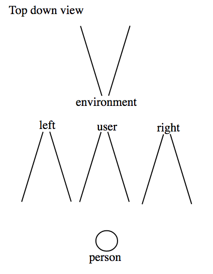

# jslib-html5-camera-photo

The first objective of this package comes from the need to have a js library that can help me to capture picture from mobile or desktop camera through the browser with the HTML5 video and canvas elements. So instead of using the native `navigator.mediaDevices.getUserMedia()` and manage the `stream` and the `constraints`, i need an abstraction it into a small lib that can switch between camera and get the desired resolution.

Another js camera ? Yes! I found [webcamjs](https://github.com/jhuckaby/webcamjs/) and [jpeg_camera](https://github.com/amw/jpeg_camera) but i need to switch easily from camera `environment` and `user`. You need to build the constraint for getUserMedia()... Another need is to have a `sizeFactor` instead of a fixing 'width' and 'height' that can not fit with the ratio of the resolution that camera can pick.

## Features of the library.
1. Choose between `environment` or `user` camera, fall back to the default camera.
2. Set `ideal resolution`, fall back to the default resolution.
3. Get the `maximum resolution` of the camera, fall back to the default resolution.
4. Choose dataURI `image format` type between `jpg` or `png`.
5. If image format is `jpg`, choose the `compression value` is the  between [0, 1].
6. Choose dataURI `image mirror` if you want to get an mirror dataURI of the camera.

## Simple Live Demo
[https://mabelanger.github.io/jslib-html5-camera-photo/](https://mabelanger.github.io/jslib-html5-camera-photo/)

## supported browsers (getUserMedia)
[https://caniuse.com/#search=getUserMedia](https://caniuse.com/#search=getUserMedia)

...(as April 2018)

## Available camera facingModes
FACING_MODES []  | Description
--- | ---
USER | The source is facing toward the user (a self-view camera).
ENVIRONMENT | The source is facing away from the user (viewing the environment).

#### Below is an illustration of the video facing modes in relation to the user.



src : [https://www.w3.org/TR/mediacapture-streams/#dom-videofacingmodeenum](https://www.w3.org/TR/mediacapture-streams/#dom-videofacingmodeenum)

### Getting started
You can use the library with vanilla JavaScript, React, Jquery, Angular...

### Installation

```bash
npm install --save jslib-html5-camera-photo
```

```bash
yarn add jslib-html5-camera-photo
```
Both Yarn and npm download packages from the npm registry.

### Usage

#### Constructor
```js
import CameraPhoto, { FACING_MODES, IMAGE_TYPES } from 'jslib-html5-camera-photo';

// get your video element with his corresponding id from the html
let videoElement = document.getElementById('videoId');

// pass the video element to the constructor.
let cameraPhoto = new CameraPhoto(videoElement);
```

#### Start the default mode (facing Mode & resolution)
If you do not specify any prefer resolution and facing mode, the default is used. The function return a promise. If the promises success it will give you the stream if you want to use it. If it fail, it will give you the error.
```js
// default camera and resolution
cameraPhoto.startCamera()
  .then((stream)=>{/* ... */})
  .catch((error)=>{/* ... */});
```

#### Start with ideal facing Mode & default resolution
```js
// environment (camera point to environment)
cameraPhoto.startCamera(FACING_MODES.ENVIRONMENT, {})
  .then((stream)=>{/* ... */})
  .catch((error)=>{/* ... */});

// OR user (camera point to the user)
cameraPhoto.startCamera(FACING_MODES.USER, {})
  .then((stream)=>{/* ... */})
  .catch((error)=>{/* ... */});
```

#### Start with ideal (facing Mode & resolution)
```js
// example of ideal resolution 640 x 480
cameraPhoto.startCamera(facingMode, {width: 640, height: 480})
  .then((stream)=>{/* ... */})
  .catch((error)=>{/* ... */});
```

#### Start with the maximum resolution
it will try the range of width `[3840, 2560, 1920, 1280, 1080, 1024, 900, 800, 640, default]` px to take the maximum width of `3840`px if it can't, `2560`px and so on ... until the fall back of the default value of the camera. The facingMode is optional.
```js
// It will try the best to get the maximum resolution with the specified facingMode
cameraPhoto.startCameraMaxResolution(facingMode)
  .then((stream)=>{/* ... */})
  .catch((error)=>{/* ... */});
```

#### getDataUri()
Function that return the `dataUri` of the current frame of the camera.
To use that function build the configuration object with the corresponding properties. To use the default value, just ommit the properties:

##### Parameters
- **sizeFactor** (Number): Used to get a desired resolution. Example, a sizeFactor of `1` get the same resolution of the camera while sizeFactor of `0.5` get the half resolution of the camera. The sizeFactor can be between range of `]0, 1]` and the default value is `1`.

- **imageType** (String): Used to get the desired image type between `jpg` or `png`. to specify the imageType use the constant IMAGE_TYPES, for example to specify jpg format use IMAGE_TYPES.JPG. The default imageType is `png`.

- **imageCompression** (Number): Used to get the desired compression when `jpg` is selected. choose a compression between `[0, 1]`, 1 is maximum, 0 is minimum. The default value imageCompression is `0.92`.

- **isImageMirror** (Boolean): Used to get an image mirror when is set to `true`, the result of the `dataUri` is the mirror of the actual camera data. Many software that use camera mirror like hangout etc... Please note if you want to enable this option, for consistency with the camera video, you need to use css `transform: rotateY(180deg)` to the **&lt;video&gt;** tag to mirror the stream, because the stream is not mirrored. It's only apply to the canvas dataUri. The default value is `false` (no mirror).

## Available image types
IMAGE_TYPES []  | Description
--- | ---
JPG | set image `image/jpeg` to the data URI
PNG | set image `image/png` to the data URI (the default value)

```js
// Use all the default value
const config = {};
let dataUri = cameraPhoto.getDataUri(config);

// OR

// Specify sizeFactor, imageType, imageCompression, isImageMirror

const config = {
  sizeFactor : 1;
  imageType : IMAGE_TYPES.JPG
  imageCompression : .95;
  isImageMirror : false;
}

let dataUri = cameraPhoto.getDataUri(config);
```

#### Get the camera settings
the function return null if no stream exist (camera not started) or an object with the camera settings attributes of (aspectRatio, frameRate, height, width).
```js
let cameraSettigs = cameraPhoto.getCameraSettings();
if (cameraSettigs) {
  let {aspectRatio, frameRate, height, width} = cameraSettigs;
  let settingsStr =
      `aspectRatio:${aspectRatio} ` +
      `frameRate: ${frameRate} ` +
      `height: ${height} ` +
      `width: ${width}`;
  console.log(settingsStr);
}
```

#### Get the input video device infos
the function return empty array [] if no input video device exist. In order to read the video devices, the browser need to start the camera with with `startCamera()` or `startCameraMaxResolution()` before calling the function `getInputVideoDeviceInfos()` it return a list of objects with the device info attributes of (kind, label, deviceId).
```js
let inputVideoDeviceInfos = cameraPhoto.getInputVideoDeviceInfos();
inputVideoDeviceInfos.forEach((inputVideoDeviceInfo) => {
  let {kind, label, deviceId} = inputVideoDeviceInfo;
  let inputVideoDeviceInfoStr = `
        kind: ${kind}
        label: ${label}
        deviceId: ${deviceId}
    `;
  console.log(inputVideoDeviceInfoStr)
});

```

#### Stop the camera
Function that stop the camera. If it success, no value is returned. It can fail if they is no camera to stop because the camera has already been stopped or never started. It will give a parameter of `Error('no stream to stop!')`. Note that each time we start the camera, it internally using this stop function to be able to apply new constraints.
```js
// It stop the camera
cameraPhoto.stopCamera()
  .then(()=>{/* ... */})
  .catch((error)=>{/* ... */});
```

### Full example vanilla Js & HTML

#### HTML
```html
<!-- needed to by the camera stream -->
<video id="videoId" autoplay="true"></video>

<!-- needed if you want to display the image when you take a photo -->


<!--buttons to trigger the actions -->
<button id="takePhotoButtonId">takePhoto</button>
<button id="stopCameraButtonId">stopCamera</button>
```

#### JavaScript
```js
import CameraPhoto, { FACING_MODES } from 'jslib-html5-camera-photo';

// get video and image elements from the html
let videoElement = document.getElementById('videoId');
let imgElement = document.getElementById('imgId');

// get buttons elements from the html
let takePhotoButtonElement = document.getElementById('takePhotoButtonId');
let stopCameraButtonElement = document.getElementById('stopCameraButtonId');

// instantiate CameraPhoto with the videoElement
let cameraPhoto = new CameraPhoto(videoElement);

/*
 * Start the camera with ideal environment facingMode
 * if the environment facingMode is not available, it will fallback
 * to the default camera available.
 */
cameraPhoto.startCamera(FACING_MODES.ENVIRONMENT)
  .then(() => {
    console.log('Camera started !');
  })
  .catch((error) => {
    console.error('Camera not started!', error);
  });

// function called by the buttons.
function takePhoto () {
  const config = {};
  let dataUri = cameraPhoto.getDataUri(config);
  imgElement.src = dataUri;
}

function stopCamera () {
  cameraPhoto.stopCamera()
    .then(() => {
      console.log('Camera stoped!');
    })
    .catch((error) => {
      console.log('No camera to stop!:', error);
    });
}

// bind the buttons to the right functions.
takePhotoButtonElement.onclick = takePhoto;
stopCameraButtonElement.onclick = stopCamera;
```
### Full example with React

A project with react is build with this library [react-html5-camera-photo](https://github.com/mabelanger/react-html5-camera-photo)

```js
import React from 'react';
import CameraPhoto, { FACING_MODES } from 'jslib-html5-camera-photo';

class App extends React.Component {
  constructor (props, context) {
    super(props, context);
    this.cameraPhoto = null;
    this.videoRef = React.createRef();
    this.state = {
      dataUri: ''
    }
  }

  componentDidMount () {
    // We need to instantiate CameraPhoto inside componentDidMount because we
    // need the refs.video to get the videoElement so the component has to be
    // mounted.
    this.cameraPhoto = new CameraPhoto(this.videoRef.current);
  }

  startCamera (idealFacingMode, idealResolution) {
    this.cameraPhoto.startCamera(idealFacingMode, idealResolution)
      .then(() => {
        console.log('camera is started !');
      })
      .catch((error) => {
        console.error('Camera not started!', error);
      });
  }

  startCameraMaxResolution (idealFacingMode) {
    this.cameraPhoto.startCameraMaxResolution(idealFacingMode)
      .then(() => {
        console.log('camera is started !');
      })
      .catch((error) => {
        console.error('Camera not started!', error);
      });
  }

  takePhoto () {
    const config = {
      sizeFactor: 1
    };

    let dataUri = this.cameraPhoto.getDataUri(config);
    this.setState({ dataUri });
  }

  stopCamera () {
    this.cameraPhoto.stopCamera()
      .then(() => {
        console.log('Camera stoped!');
      })
      .catch((error) => {
        console.log('No camera to stop!:', error);
      });
  }

  render () {
    return (
      <div>
        <button onClick={ () => {
          let facingMode = FACING_MODES.ENVIRONMENT;
          let idealResolution = { width: 640, height: 480 };
          this.startCamera(facingMode, idealResolution);
        }}> Start environment facingMode resolution ideal 640 by 480 </button>

        <button onClick={ () => {
          let facingMode = FACING_MODES.USER;
          this.startCamera(facingMode, {});
        }}> Start user facingMode resolution default </button>

        <button onClick={ () => {
          let facingMode = FACING_MODES.USER;
          this.startCameraMaxResolution(facingMode);
        }}> Start user facingMode resolution maximum </button>

        <button onClick={ () => {
          this.takePhoto();
        }}> Take photo </button>

        <button onClick={ () => {
          this.stopCamera();
        }}> Stop </button>

        <video
          ref={this.videoRef}
          autoPlay="true"
        />
        
      </div>
    );
  }
}

export default App;
```

### import the UMD module with HTML script tag

You can build the dist and then serve it with :

```sh
$ npm run buildBrowser
$ npm run serve:dist
```

Or you can copy the [dist](./dist) folder of the repo.

Example :

```html
<script src="/jslib-html5-camera-photo.min.js"></script>
<script>
  ...
  var FACING_MODES = JslibHtml5CameraPhoto.FACING_MODES;
  var cameraPhoto = new JslibHtml5CameraPhoto.default(videoElement);
  ...
</script
```


### Development
I choose the env dev of create-react-app even if it is vanilla js library because it's simple to use and really efficient to develop but you don't necessarily need react to use it. If you want to fix bug or add functionalities please [contribute](./CONTRIBUTING.md) :)

### Documentations
- [Auto scan resolution camera](https://webrtchacks.github.io/WebRTC-Camera-Resolution/)
- [Great info of new API](https://webrtchacks.com/getusermedia-resolutions-3/)
- [W3 specs](https://www.w3.org/TR/mediacapture-streams/)

### Other interesting projects
- [Webrtc/adapter](https://github.com/webrtc/adapter)
- [GetUserMedia.js](https://github.com/addyosmani/getUserMedia.js)
